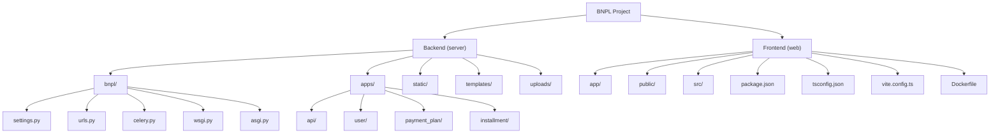

# BNPL Backend

A Django-based backend service for a Buy Now, Pay Later (BNPL) system. This service handles user management, payment plans, and installment tracking.

## Features

- User authentication and authorization using JWT
- Payment plan management
- Installment tracking
- RESTful API with Swagger documentation
- Admin panel for system management
- Celery for background task processing
- Redis for caching and message broker
- PostgreSQL database

## Prerequisites

- Python 3.13+
- [uv](https://github.com/astral-sh/uv) - Python package installer and resolver
- PostgreSQL
- Redis
- Node
- PNPM

## Project Structure



## Manual Installation

The server (Django) directory is `server`, and the Web client (React) directory is `web`, the server and the client must be running to ensure that the entire application is running correctly

### Backend

1. Switch to the backend and create `.env` file

```bash
cd server
cp .env.example .env
```

1. Create a virtual environment and install dependencies using uv:

```bash
uv sync
```

2. Create the database using a postgresql client like `PgAdmin4` or `psql`

3. Run migrations:

```bash
make migrate
```

4. Create a superuser:

```bash
make createsuperuser
```

5. Run the development server:

```bash
make
```

6. Start Celery worker (in a new terminal):

```bash
uv run celery -A bnpl worker -l info
```

7. Start Celery beat (in a new terminal):

```bash
uv run celery -A bnpl beat -l info
```

### Frontend

1. Change directory to the client, and install dependencies

```shell
cd web
pnpm install
```

2. Start the development client

```shell
pnpm dev --open
```

## Docker Deployment

## Access Points

- API Documentation (Swagger): <http://127.0.0.1:8000/api/v1/swagger/>
- ReDoc Documentation: <http://127.0.0.1:8000/api/v1/redoc/>
- Admin Panel: <http://127.0.0.1:8000/admin/>
- Silk profiler: <http://127.0.0.1:8000/silk/>
- Frontend: <>
